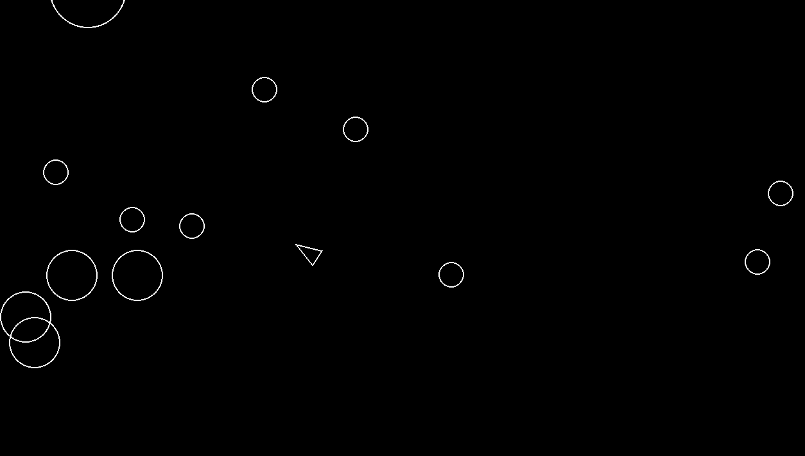

# Asteroids (Pygame)



A recreation of the classic **Asteroids** arcade game built with **Python** and **Pygame**.

This project was created as part of the **Build Asteroids** guided project from Boot.dev. It serves as an introduction to game development concepts such as game loops, object-oriented programming, collision detection, sprite management, and user input handling.

## Gameplay

Take control of a spaceship and survive in an asteroid field. Destroy asteroids before they collide with your ship, but watch out—large asteroids split into smaller fragments when shot, making the game progressively more challenging.

## Controls

| Action          | Key     |
| --------------- | ------- |
| Rotate Left     | `A`     |
| Rotate Right    | `D`     |
| Thrust Forward  | `W`     |
| Thrust Backward | `S`     |
| Shoot           | `Space` |

## Installation

Clone the repository:

```bash
git clone https://github.com/neotech-emanuel-juric/asteroids.git
cd asteroids
```

Install dependencies:

```bash
uv sync
```

Run the game:

```bash
uv run main.py
```

## Features

* Smooth spaceship controls
* Asteroid spawning and movement
* Projectile shooting mechanics
* Asteroid splitting behavior
* Collision detection
* Built with Python and Pygame

## Learning Objectives

This project demonstrates:

* Game loops and frame updates
* Object-oriented design
* Event and input handling
* Collision detection
* Entity management
* Basic game physics concepts

## Credits

Created by **Emanuel Juric** as part of the **Build Asteroids** guided project by Boot.dev.

Boot.dev Course: https://www.boot.dev/courses/build-asteroids-python
